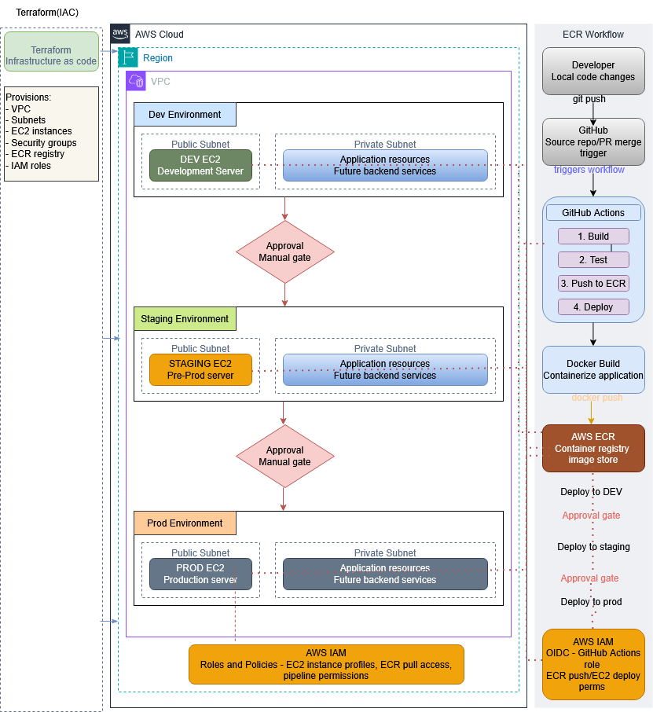
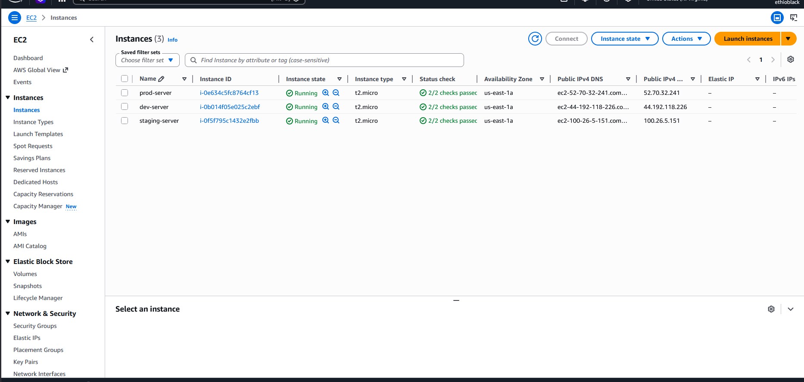
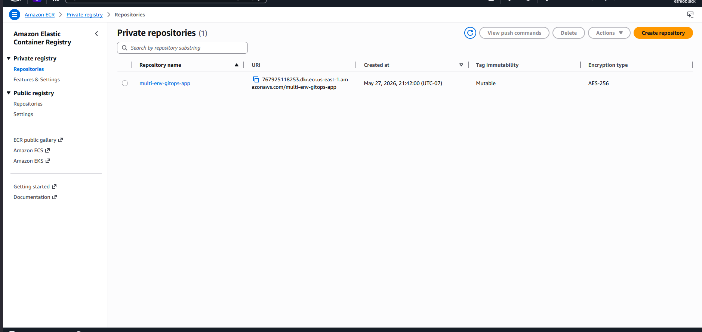
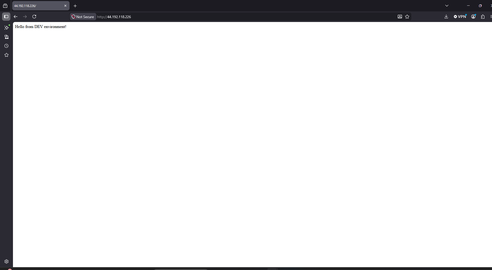
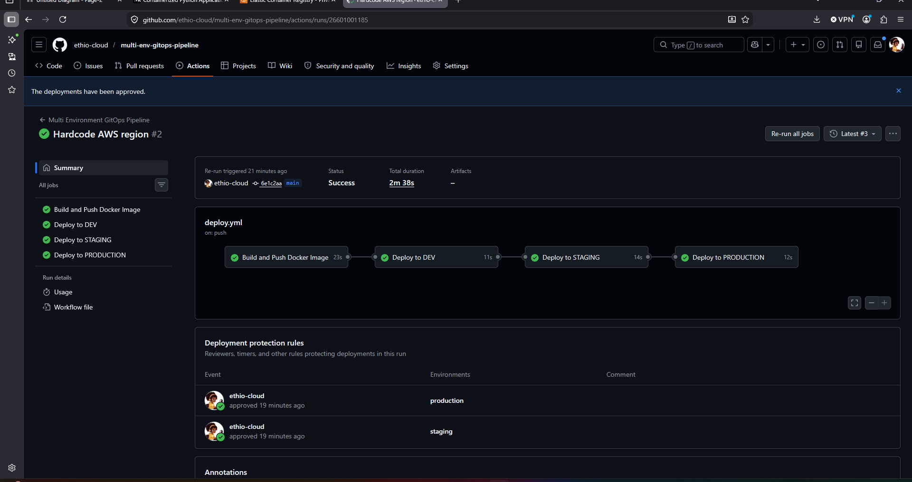

# Multi-Environment GitOps Pipeline with Terraform

## Project Overview

This project demonstrates a GitOps CI/CD pipeline using GitHub Actions, Terraform, Docker, AWS EC2, and AWS ECR.

The pipeline deploys a containerized Flask application across three environments:

- Development
- Staging
- Production

Manual approval gates are required before staging and production deployments.

## Architecture

Developer pushes code to GitHub → GitHub Actions builds Docker image → Image is pushed to ECR → DEV deployment → Manual approval → STAGING deployment → Manual approval → PRODUCTION deployment.

## Tools Used

- GitHub
- GitHub Actions
- Terraform
- AWS EC2
- AWS ECR
- Docker
- Python Flask
- IAM

## Environments

| Environment | Deployment      |
| ------------|------------     |
|         DEV | Automatic       |
|     STAGING | Manual Approval |
|  PRODUCTION | Manual Approval |

## Architecture Diagram

## Screenshots

### EC2 Instances

### ECR Repository

### DEV Environment

### GitHub Actions Pipeline

## What I Learned

- Infrastructure as Code with Terraform
- CI/CD with GitHub Actions
- Docker image build and deployment
- AWS ECR container registry
- EC2 server deployment
- Manual approval gates
- Multi-environment release workflow

## Author

Kalkidan Bogale
